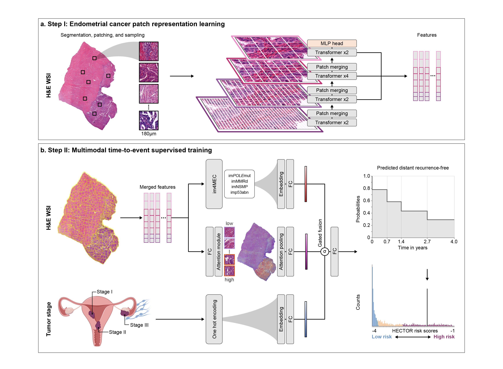

# HECTOR

**HECTOR** - **H**istopathology-based **E**ndometrial **C**ancer **T**ailored **O**utcome **R**isk. 

HECTOR is described in the pre-print https://www.medrxiv.org/content/10.1101/2023.11.27.23298994v1. 

HECTOR is a multimodal deep learning model to predict clinical endpoint, here distant recurrence-free probability from digitized tumour slide (here H&E-stained) and categorical risk factors, here the tumour stage, in endometrial cancer.


*HECTOR pipeline*

# Install dependencies

The below command creates an unnamed conda environment in your working directory.

```sh
conda env create --prefix ./.conda -f environment.yml
conda activate ./.conda
```

# Extract patch-level features from an encoder, for instance one trained with self-supervised learning.

As HECTOR uses Multiple Instance Learning, each whole slide image needs to be converted into a bag of feature vectors using a feature extractor model. 

We recommend using the feature extractor of your choice and adapt the two functions extract_features and load_model in the extract_features.py code. In the publication, we trained [EsVIT](https://github.com/microsoft/esvit) on endometrial cancer patches, for which we have provided an example on how to load the encoder and extract the EsVIT features from the last n blocks. For the latter method or similar, the following command can be used. Note that avgpool_patchtokens, n_last_blocks, patch_size, arch, cfg, are specific to the use of EsVIT, for which the esvit repository needs to be downloaded in the HECTOR repository.  

All feature vectors of a WSI will be saved together in a 'feature bag' in the `.pt` file format. Additionally, features are structured as a nested numpy array such that features that are semantically (cosine similarity threshold option) and spatially (L2 norm threshold option) similar are saved together and can be averaged if needed in the FeatureBagsDataset from utils.py. A quality control image will be generated in the same output directory so the user can evaluate the quality of the tissue segmentation and patching.

Background segmentation can use Otsu Thresholding or Stain deconvolution. The latter needs to import histomicstk using pip install histomicstk --find-links https://girder.github.io/large_image_wheels

```sh
python extract_features.py \
--input_slide /path/to/your/WSI.svs \
--output_dir /path/to/where/features/are/saved/ \
--tile_size 180 \
--out_size 256 \
--batch_size 256 \
--method 'otsu' \
--dist_threshold 3 \
--corr_threshold 0.8 \
--checkpoint /path/to/your/checkpoint/encoder/.pt  \
--workers 4 \
--avgpool_patchtokens False \
--n_last_blocks 8 \
--patch_size 8 \
--arch swin_tiny \
--cfg 'config_files/swin_tiny_patch8_window14_256_stage3_4x.yaml' \
```

# Training HECTOR

HECTOR takes as input the bag of patch-level features, the tumor stage category and has im4MEC nested to predict image-based molecular class. 

## Prepare your dataset
You should have a csv file where labels and input data information are reported. Path of this csv file should be mentioned in the manifest argument. This file should contain a single line for each WSI in your dataset. The csv file containing input data information and labels need to be structured as follow: 
- a "slide_id" column which contains the name of the slide; 
- a "stage" column where the the tumor stage category is listed as 0,.., K-1. Note that another categorical risk factor could be used instead. 
- a "disc_label" column which is the discretized time into 0 to N-1 bins as reported in n_bins as we used the negative log likelihood loss with discrete time intervals
- a "recurrence_years" column which is the time to last follow-up or time to endpoint in years
- a "censorship" column which is 0 if the case experienced the event and 1 otherwise
- a "split" column with values either training or validation

## Nesting the im4MEC model 
For [im4MEC](https://github.com/AIRMEC/im4MEC/), we use the the im4MEC.py codebase and the checkpoint needs to be reported in --checkpoint_model_molecular, as well as other information related to the model architecture. This bit is optional and can be removed or replaced by another categorical risk factor for instance.

## Training HECTOR

Any architectural parameter of HECTOR can be changed in the hparam_sets list of the train.py code with the correct hp index. The following command can be subsequently used. Code related to metric computation and tensorboard log can be found in utils.py. Model is trained on training split and evaluated after each epoch on validation as defined in the csv file. 

```sh
python train.py \
--manifest /path/to/csv/file/with/data/.csv \
--n_bins 4 \
--data_dir /path/to/where/features/are/saved/ \
--input_feature_size 3456 \
--checkpoint_model_molecular /path/to/your/checkpoint/im4mec/.pt \
--n_classes_molecular 4 \
--feature_size_comp_molecular 512 \
--feature_size_attn_molecular 256 \
--workers 4 \
--hp 0
```

# Evaluating HECTOR on a test set

Code will be released in a few days. 